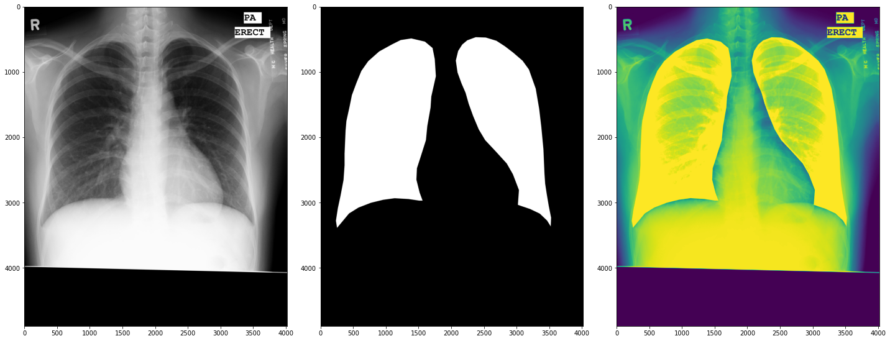

# dltb

Using computer vision to classify and tuberclosis and lung segementantion using Montgomery dataset from https://www.ncbi.nlm.nih.gov/pmc/articles/PMC4256233/

From the dataset:
>The MC set has been collected in collaboration with the Department of Health and Human Services, Montgomery County, Maryland, USA. The set contains 138 frontal chest X-rays from Montgomery County’s Tuberculosis screening program, of which 80 are normal cases and 58 are cases with manifestations of TB. The X-rays were captured with a Eureka stationary X-ray machine (CR), and are provided in Portable Network Graphics (PNG) format as 12-bit gray level images. They can also be made available in DICOM format upon request. The size of the X-rays is either 4,020×4,892 or 4,892×4,020 pixels. 


# Getting Started
The dataset gets pulled from kaggle using opendatasets if it doesn't exist.

Kaggle dataset link: https://www.kaggle.com/kmader/pulmonary-chest-xray-abnormalities.

1. Login into kaggle, head over to the account and get the API token. This is going to needed by 
open datasets to download the dataset.


## Run Locally

Clone the project

```bash
  git clone https://github.com/mrdvince/dl4tb.git
```

Go to the project directory

```bash
  cd dl4tb
```

Install dependencies

Using cpu version of pytorch, if you have a supported GPU for training get that version of pytorch.
```bash
  pip install -r requirements.txt
```

Start the training

```bash
    python src/train.py
```

### Available args thanks to [hydra](https://github.com/facebookresearch/hydra)

Add the -h flag to check all the available settings and override some.

```bash
python src/train.py -h

(.env9) ➜  dl4tb git:(master) ✗ python src/train.py -h
Global seed set to 69420
train is powered by Hydra.

== Configuration groups ==
Compose your configuration from those groups (group=option)


== Config ==
Override anything in the config (foo.bar=value)

model:
  num_classes: 2
  lr: 0.001
data:
  data_url: https://drive.google.com/uc?id=1KdpV3M27kV-_QOQOrAentfzZ2tew8YS-&
  lung_mask_ds_url: https://www.kaggle.com/kmader/pulmonary-chest-xray-abnormalities
  lm_batch_size: 16
  cl_batch_size: 64
  data_dir: data
  zip_file: tb_data.zip
  exports_dir: saved/exports
  cxr_dir: data/proc_seg/cxr_pngs
  mask_dir: data/proc_seg/mask_pngs
  lung_mask_raw_dir: data/pulmonary-chest-xray-abnormalities/Montgomery/MontgomerySet/CXR_png
  lung_mask_dim: 256
training:
  max_epochs: 10
  log_every_n_steps: 10
  limit_train_batches: 1.0
  limit_val_batches: 1.0
  save_dir: saved
  deterministic: true
  device: cpu
  num_instances: 1
  bucket_cap_mb: 125
  cores: 8
  model: unet


Powered by Hydra (https://hydra.cc)
Use --hydra-help to view Hydra specific help

```

## Exporting model to onnx and torchscript

```bash
    # <model checkpoint path> modify this to the path of your model
    python src/export.py '+cfg.ckpt_path="<model checkpoint path>"' 
```
